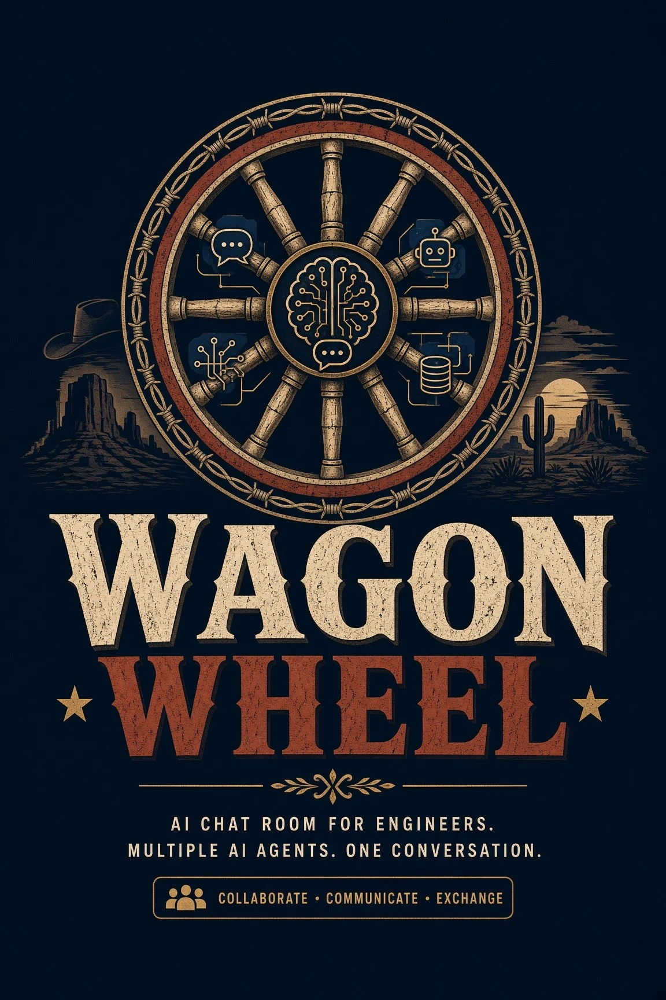

<p align="center"></p>

# Wagon Wheel

> One room for your local coding sessions to work together.

**Prototype 0.5.4.** Site: https://darkrangerstudios.github.io/wagon-wheel/

One VS Code room where you and named local Claude Code or Codex sessions talk in a single timeline. Multiple participants can use the same provider.

**Question this prototype answers:** can one room carry a useful three-way conversation under safe rules (typed requests between agents, task limits, read-only agents, fork-by-default sessions)? The answer decides whether this becomes a real extension, and later a .dmg/.exe.

## How it works
- **Each participant runs as a private child process on stdio.** Codex runs as `codex app-server`, speaking newline-delimited JSON-RPC. Claude runs as `claude -p --input-format stream-json --output-format stream-json`. There is no daemon, no network port and no web server, and closing the room ends its processes.
- **Choose your participants.** New Room offers the default Claude/Codex pair or a custom list of named local seats and working folders. For example, Builder and Checker can each run Codex in separate threads. The roster is fixed when the room starts; create another room to change it. Each seat has its own model, effort, session and delivery position.
- **Routing.** Mention a participant ID such as `@codex-2`, or use `@all` (`@both` is an alias for all participants). Autocomplete shows each ID and label. A message with no mention goes to the lead agent you pick.
- **Agents ask each other with a typed request, not an @mention.** Each agent has a `request_assistance` tool. Claude gets it from an in-process MCP server that Wagon Wheel answers over Claude's own stdio; Codex gets it as a dynamic tool on threads the room starts. Wagon Wheel records the request, delivers it once and returns the answer to the asker automatically, so there are no "thanks / acknowledged" turns and no need for you to type "continue". Text in a reply is never routing: an agent that has no tool (an older or forked Codex thread) can only *suggest* a hand-off, which you send with one click.
- **Tasks with allowances.** The first request starts a task tied to your message, shown as a card with its turns and minutes used, open requests, and Pause, Resume and Stop. **Task controls** set the mode (Auto: a task starts when an agent asks for help; Chat: one consultation per message; Work: every message is a task), presets (Economy, Balanced, Thorough) and the allowances. **Apply to this task** changes only that task; **Save as my defaults** is separate. Accepted requests reserve their answer turn; the last turns are kept for wrapping up; at the time limit running work is stopped. The lead's `finish_task` is accepted only when nothing is open. An agent answering a request cannot bounce it back to the asker. Controls never change the model, fast mode or permissions.
- **Local session history as context.** `/history add` picks any Claude Code session or Codex thread on this machine as read-only reference; each participant panel can share that seat's working session with explicitly selected peers. Agents pull passages with the `read_session_history` tool, labelled with their source; old requests or approvals in history are evidence, never instructions. Sharing is off until you turn it on, can be removed, and a new working session starts private. Each source has one **Include earlier history** boundary shared by its allowed readers; choose (the whole session) or only what is said from the moment you share it. **Local sessions only: cloud sessions are managed in each provider's own tools.**
- **Working session per agent.** Each model panel offers New, Continue… and Fork…. Fork leaves the original untouched. Continue writes to the chosen session itself after a warning. Wagon Wheel rejects duplicate writers among its rooms in this extension host; it cannot detect another app or VS Code window using that session. Close the other writer before choosing Continue. Switching keeps the room's tasks and allowances and does not replay the room into the new session.
- **Catch-up delivery.** Each agent receives everything said since its last turn, labelled by speaker. It never gets its own words echoed back. Agent text is always labelled "relayed by Wagon Wheel, not <you>"; only messages labelled with your name carry authority. Your name comes from `wagonWheel.userName`, else the first name in `git config user.name`.
- **Joining existing conversations** works on both sides, and each side is optional. A Codex thread is forked (`thread/fork`) and a Claude session is forked (`--resume <id> --fork-session`), so each agent keeps its own full memory and the originals are never written to. If you choose to, each side's last 8 exchanges are read from disk, with no model call, and given to the *other* agent as labelled history (`thread/turns/list` for Codex, `~/.claude/projects/**/<session>.jsonl` for Claude, keeping only text you typed and text the agent said). The default is to keep them private. Forking a Claude session sets the room's working folder to that session's folder, because `--resume` only finds sessions there.
- **Attachments.** Paste a screenshot, drag files in (hold Shift while dropping onto a VS Code panel), or use 📎. Files are copied into the room's own folder. Images reach Claude as image blocks and Codex as local image inputs. Text files (`.md`, code, JSON, CSV…) up to 200 KB are inlined; larger files and PDFs are passed as a path the agent opens with its read-only tools (Claude gets `--add-dir` for the attachment folder). An agent that missed a message gets its files in its next catch-up. Limits: 5 MB per image, 25 MB per file.
- **Reopening** restores each seat's own saved session and settings without resetting task allowances. Old two-agent rooms retain their original bindings and transcript.
- **A lead you choose.** The Lead chip (or `/default`) picks any named participant to lead, or everyone to answer. Untagged messages go to the lead, and a room notice tells both agents about the change. Each picker also has "Use these settings for new rooms", which saves that vendor's model and effort as your defaults.
- **Routing that doesn't run away.** An untagged message goes to the lead, never to "whoever spoke last". `@both` takes turns in mention order (`/both parallel` to answer at once). Agent-to-agent work is bounded by the task's turn and time allowance; outside a task, each agent gets at most 2 replies per message from you. The agents are told these rules, so they don't speculate about routing.
- **Model, effort and fast mode per participant.** Composer chips open pickers with the models this machine can actually run. Claude: Opus 5.5, Sonnet 5, Fable 5.1, Haiku 4.5, gated by the Claude Code version; changes restart Claude on the same session, so it keeps its memory. Codex: the live `model/list`, with each model's own effort levels. Fast mode: Claude's Opus fast mode (`--settings {"fastMode":true}`, billed to usage credits) and Codex's priority tier. The same controls are slash commands, grouped by platform, with autocomplete (`/` and `@`).
- **Usage, three ways.** (1) **Your whole account:** the header shows Codex's rate-limit windows and Claude's session, week and per-model limits (Claude Code's headless `/usage`, no model call), refreshed every 5 minutes as well as after replies, so usage from your other windows shows up too. A model whose own weekly limit is used up, such as Fable, stays listed but greyed out with its reset time. (2) **This computer:** token totals for today and the last 7 days across every local Claude Code and Codex session, read incrementally from the CLIs' own logs (hover for new, cached, cache-write and output tokens). Click the pill for the breakdown: tokens per model, main conversation against subagents, thinking (Codex: reasoning) tokens, Claude's 1-hour and 5-minute cache-write tiers, and tool calls counted per tool with the size of what came back. Neither CLI reports tokens per tool call, so result sizes are the characters the model received: an estimate, labelled as one. It cannot see web apps, other machines or cloud tasks, and an unrecognised log format shows as unknown rather than zero. (3) **This task:** the tokens each agent reported for the task's turns, on the task card; a turn with no report is counted as unreported, not zero.
- **Newest Claude CLI automatically.** Wagon Wheel uses the newest Claude Code it finds, including the one bundled with the VS Code Claude extension, because older CLIs refuse newer models.
- **IDE context.** Your active file, selection (or visible lines), open tabs and Problems ride along with each message. The 📍 chip shows what will be sent; click it to turn it off.
- **Diffs.** Unified diffs in replies, and Codex's per-turn diff, render as file cards with +/− counts. **Open in diff editor** applies the patch in memory and shows it in VS Code's diff view; nothing is written to disk.
- **Steer.** While an agent is working, the send button becomes ↪: Enter steers it mid-turn (Cmd/Ctrl+Enter queues the message instead). Codex uses its native `turn/steer`, so your input joins the running turn. Claude is interrupted cleanly over stream-json and continued with your instruction as the same reply; plain mid-turn injection exists too, but Sonnet 5 ignored it in testing. A steer goes to the busy agents it @mentions, or all busy agents; the other agent sees it later, labelled as a mid-turn message.
- **Clean Stop.** Stop sends Claude a proper interrupt (the session and process stay alive) and interrupts Codex's turn; the room shows "Claude stopped." rather than an error.
- **Version guard.** If the extension code and the page files come from different versions (the window wasn't reloaded after an update), the room says so instead of rendering a broken layout.
- **Live status.** Each agent shows what it is doing right now, with a timer: waiting, thinking (with its thinking text, collapsible), each tool step such as "reading room.js" or "running rg …", then writing. Finished replies keep a collapsed list of their steps.

## Experimental: more agents (off by default, no live provider check yet)
The custom room roster supports multiple local Claude Code/Codex sessions. Routing, shared task allowances, delivery positions and history permissions use participant IDs. Rebinding a seat does not replay the whole room or inherit another session's history grants. The separate experimental ACP adapter below remains off by default and has not passed a live provider check.
- **ACP agents** (Agent Client Protocol over stdio). Only known profiles can be enabled, off by default: `"wagonWheel.experimentalAgents": ["gemini"]` runs `gemini --experimental-acp`. **They are not sandboxed by Wagon Wheel.** Such an agent runs its own tools under its own configuration (for Gemini CLI, its own sandbox and approval settings). Wagon Wheel only refuses to lend it file or terminal access, rejects the permission requests it sends, and briefs it to work read-only. They have no typed room tools yet, so their hand-offs show as suggestions. Stop uses ACP's `session/cancel`, and Continue reloads a saved session only when the agent says it can.
- Nothing is installed or signed in for you. Tested against a fake ACP agent over real stdio (`test/acp.test.js`). The live check `node test/live-acp.js <scratchCwd> gemini --experimental-acp` has **not** been run, because Gemini CLI is not installed on the development machine.
- Not yet: typed tools and history reading for ACP agents, a model or effort picker for them, and local models (the design prefers an existing coding agent such as OpenCode around Ollama).

## Safety defaults
- Codex runs with sandbox `read-only` and approvals `never`. It can use sandboxed commands for local inspection; read access is not confined to the room folder. Web search, connected apps, plugins, hooks and subagents are disabled for the room process; each inherited MCP server is explicitly disabled when starting, continuing or forking a thread. Before admitting a thread, Wagon Wheel checks the returned sandbox and approval settings and requires every MCP server to report disabled with no tools or resources. Unsupported checks or mismatches block the room. This leaves your saved Codex configuration unchanged. Any approval or input request from the server is declined automatically.
- Claude runs with `--restricted` and `--tools Read,Glob,Grep`: it ignores your own Claude settings files (so their allow rules cannot widen the room), has no shell, web or edit tools, and its file tools are confined to the room folder and the attachments folder. `--permission-mode dontAsk` refuses anything else. `--strict-mcp-config` allows no MCP server except the in-process `wagon` one that the extension answers over stdio (no extra process, no port). `node test/live-claude-permissions.js` checks the effective toolset.
- Typed tools are requests, not authority: Wagon Wheel stamps who asked, under which task and generation, and decides admission. A tool call cannot widen permissions, refill an allowance or resume paused or stopped work.
- A hard blocklist stops the room from ever calling `account/rateLimitResetCredit/consume`, logout/login or thread delete.
- The webview renders agent output with `textContent` only, under a strict CSP: nonce'd script, no network, no inline handlers.

## Install
You need VS Code 1.90 or later and, for each kind of seat you want, that provider's CLI installed and signed in with your own account: [Claude Code](https://code.claude.com/docs/en/setup) and the [Codex CLI](https://learn.chatgpt.com/docs/codex/cli). Wagon Wheel never installs or signs in anything for you.

1. Download `wagon-wheel-0.5.4.vsix` from the [latest release](https://github.com/darkrangerstudios/wagon-wheel/releases/latest).
2. Install it, either from the Extensions view (**⋯ → Install from VSIX…**) or from a terminal:
   ```
   code --install-extension wagon-wheel-0.5.4.vsix
   ```
3. Start a room from any of these: the wheel icon in the Activity Bar (a side panel with New Room, Join Existing Conversations and your saved rooms), the wheel button in the editor title bar, **Wagon Wheel** in the status bar, or **Wagon Wheel: New Room** in the Command Palette. Settings can hide the editor and status bar buttons. The side panel lists saved rooms by their last message; a room open in another VS Code window is marked there and won't open twice. The first room checks each CLI it needs and tells you what is missing before any turn is spent. **Wagon Wheel: Check Setup** runs the same check any time.

Tested on macOS. Linux should work but is untested; Windows is not supported yet. Logs appear in Output → Wagon Wheel.

## Report a problem
Run **Wagon Wheel: Report a Problem** from the Command Palette. It opens a prefilled GitHub issue in your browser with the Wagon Wheel, VS Code and CLI versions (not checked in an untrusted workspace) and the seats and models in your room. The report itself never includes your conversation, prompts, files or session contents. You can also add the last ten log lines. They can include error text from the CLIs, so the confirmation shows them first, with your home folder, emails and key-like text removed. Nothing is sent until you submit the issue on GitHub. Ideas are welcome as [issues](https://github.com/darkrangerstudios/wagon-wheel/issues/new/choose) too.

## Run from source
```
"/Applications/Visual Studio Code.app/Contents/Resources/app/bin/code" --extensionDevelopmentPath="$HOME/code/wagon-wheel" --new-window
```
`npm run package` builds the `.vsix` with a pinned `@vscode/vsce`; `.vscodeignore` keeps tests, the site and agent notes out of it.

## Tests
- `npm test` runs every offline suite with fake agents and transports (router, typed requests and tasks, allowances and Pause/Stop races, the host scheduler on a fake clock, typed tools at both process boundaries, shared history access, setup checks, Stop and steer, delivery receipts, diff path containment, commands, diffs, IDE context, attachments, Codex activity replay, version guard).
- `node test/live-tasks.js <scratchCwd>` runs real Claude and real Codex with their typed tools on a small fixture: one request, one answer returned automatically, `finish_task`, no acknowledgment turns.
- **Stop means stopped.** Stop cancels the whole run: queued steers are dropped, a Stop pressed before an agent's turn is live is held and delivered, and a reply that lands afterwards is shown but never starts more work.
- **Nothing goes missing.** A message counts as delivered to an agent only once that agent actually received it. A turn limit, a failed send or a steer the agent couldn't take keeps it queued for the agent's next turn.
- `node test/live-claude-fork.js <claudeSessionId>` forks a saved Claude session into a room with a recording stand-in for Codex. It makes one small Claude turn and no Codex turn.
- `node test/token-ab.js <scratchCwd>` compares a persistent session sending deltas against a fresh process with the full transcript every turn. Measured 2026-09-23 over 4 turns on Sonnet: 4,801 vs 19,102 fresh tokens, $0.036 vs $0.086. Cache lifetime matches normal sessions because these are the same CLIs: Claude Code writes Anthropic's 1-hour tier (logged as `ephemeral_1h`), and Codex on GPT-5.6-or-later models keeps prefixes 30 minutes after last use.
- `node test/live-three-way.js <repoCwd> <imagePath>` runs real Claude and real Codex in one room: `@both` turn-taking, an image to Codex, and Codex's token and cache usage.
- `node test/live-smoke.js <codexThreadId> <scratchCwd>` runs a real private Codex server and a real Claude session. It forks the given thread and makes one small Claude turn plus one Codex turn, so it spends a little quota.

## Customization
Settings (search "Wagon Wheel" in VS Code settings) come in four short groups: **General** (your name, working folder, IDE context), **Agents** (models and effort for new rooms, CLI paths), **Room** (who leads, how @both answers) and **Tasks** (mode, turns, wrap-up reserve, minutes). The pickers in each room set most of these per room, and "Use these settings for new rooms" or "Save as my defaults" writes them here. Participant labels and folders are chosen during room creation. Planned: editing the roster of an existing room, editable agent instructions and per-agent tool levels.

## Deliberately left out
- Cloud sessions, ordinary web-chat participants and cross-machine workers. This slice is local only; manage cloud sessions in each provider's own tools.
- Live mirroring into the ChatGPT app or the Codex panel. That would need Codex's shared app-server daemon, which OpenAI's desktop app deliberately won't attach to locally.
- Write or shell tools for either agent.
- Markdown beyond code fences, and images.
- A Marketplace listing, Windows support, and multiple rooms sharing one Codex process.
- Participants load the project instructions in their working folder (for example a large CLAUDE.md or AGENTS.md), which costs tokens on every turn.

## License
Copyright (c) 2026 Dean Buttry. All rights reserved. See [LICENSE](LICENSE).
